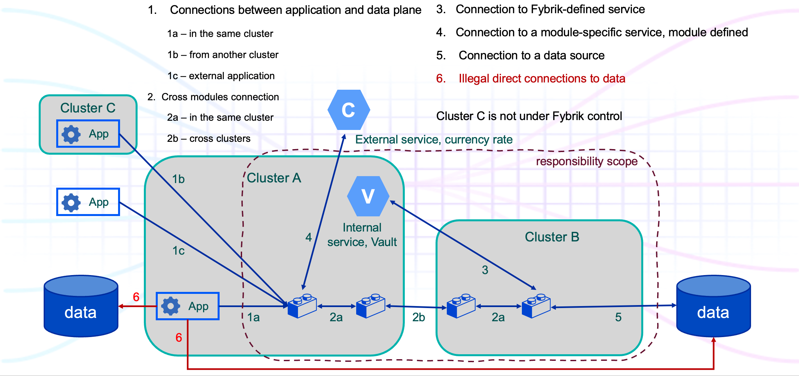

# Fybrik data plane network connection types and isolation requirements

## Introduction
This document explains Fybrik data plane network topologies and isolation requirements.
We have started from the data plane because it is dynamically created and might include third-part developed components.
Furthermore, user data is accessed, modified and moved by the data plane only.
Therefore, networking isolation and protection of data plane is very important and challenged task, and we start from it.

### Types of Fybrik Network Connections
Fybrik data plane can be spread across several Kubernetes clusters and theoretically include any number of modules. 
The following picture demonstrates different Fybrik data plane connection types.

User applications (workloads) achieve the Fybrik data plane via its entry point. Depends on the location of the
application we can separate 3 different connection types:
- `1a` - the application and the data plane entry module are collocated on the same Kubernetes cluster.
- `1b` - the application is running on a Kubernetes cluster, but Fybrik cannot control the cluster.
- `1c` - the application is not deployed on a kubernetes cluster.

In all these connections, the Fybrik entry point is a server, and user applications are clients. Connections `1b` and
`1c` require external access to the Kubernetes pods, a public entry point or other mechanisms.  
We will start with isolation of the `1a` connections. Isolation and protection of other connections types will be investigated later.

In the connections `3`, `4`, and `5` Fybrik modules are clients that connect to services or data sources. From the
networking isolation point of view, the main difference between the connections is who defines them.
- connection `3` is defined by Fybrik and used for helper functionality, e.g. connect to the Vault service
- connection `4` is used by a specific module and is part of the module definition.
- the destination of connection `5` (data source) is required by a Fybrik application user, and Fybrik builds a data
plane to satisfy this requirement.   

We don't separate destinations of the connections (in the cluster or outside it), like in the case of connections `1a`, `1b`, and `1c`, because in all
these cases Fybrik modules are clients, we don't have to change the data plane components to achieve them.

In addition to the legal Fybrik connections, the picture above demonstrates illegal direct connections `6` from user 
applications to the data sources, by-passing Fybrik. In order to obey  governance rules and IT policies, user applications 
should always access data sets via Fybrik only.

## Challenge

When we talk about Fybrik data plane isolation, we are talking about connectivity between user application workloads, 
which are out of Fybrik control (at least for now), and Fybrik modules, which can be developed by third parties. 

## Requirements

- Only predefined users/workloads should be able to access the data plane.
- User workloads should not be able to access data set directly, bypassing Fybrik, connections `6` on the connection types
picture 
- If a data plane consist of a module chain we should prevent unauthorized access to the intermediate modules too.
- Modules should not be able to "illegally" communicate with modules, services and data sets outside the defined data plane(s).
- Fybrik should do _as much as possible_ to provide network isolation and protection automatically and transparent to the
users. However, some input from users will be required, see the next part.

## Responsibilities

Responsibility of the data plane isolation is shared between Fybrik core, Fybrik users, module developers and probably IT teams.

- Fybrik users should inform Fybrik about possible workload locations and configure their workloads accordingly.
  For example, to set labels on the workload pods and inform Fybrik about the labels and the namespace where the 
  workload is deployed.

- Modules might support certain protection mechanisms, such as TLS/mTLS, IAM or JWT tokens, and others. These modules
  should declare which mechanisms they support in their manifests. Fybrik users may require that the entire data plain will
  be built with these features. Fybrik core should support it.

- Depending on the isolation method, Fybrik core should propagate all the relevant information to the deployed modules (e.g. 
  information about possible network clients), and/or correctly configure a chosen protection mechanism, e.g. Network Policies,
  tokens, certificates, keys, ...

- In some complicated cases, IT teams intervention can be required, e.g. to configure external access points, firewalls and so on.

## Solutions, recommendations

The data plane protection can be based on a combination of different methods. They are 
- Kubernetes Polices, see [Fybrik Network Policies isolation](IsolationNetworkPolicies.md)
- Identity and Access Management (IAM) token
- JSON Web Token (JWT)
- Transport Layer Security (TLS)
- others