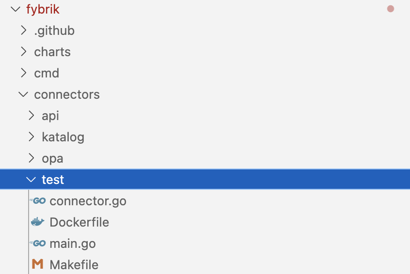

# Steps to creating a new REST API using Fybrik Taxonomy


## TL;DR

* Suppose you want to add a REST method  createNewComponent in the datacatalog list of apis.
* Edit connectors/api/datacatalog.spec.yaml.
* Edit pkg/model/datacatalog/api\.go.
* Run make generate in fybrik root
  * Generates json files. Remove external.json. Keep the others.
* make generate-client-datacatalog
  * Generates openapiclient files in pkg/connectors/datacatalog/openapiclient
  * Add these two lines in pkg/connectors/datacatalog/openapiclient/model.go.
  ```golang
    * type CreateNewComponentRequest = datacatalog.CreateNewComponentRequest
    * type CreateNewComponentResponse = datacatalog.CreateNewComponentResponse
  ```
* Define the new method in pkg/connectors/datacatalog/clients/datacatalog.go
```golang
  * CreateNewComponent (in *datacatalog.CreateNewComponentRequest, creds string) (*datacatalog.CreateNewComponentResponse, error)
  ```
* Add the implementation of CreateNewComponent() method (client side) in datacatalog_openapi.go.
* Add server side implementation of CreateNewComponent in any connector
* Add CreateNewComponent implementation in manager/controllers/mockup.
* make verify to fix tab issues.

## Longer Version


### Step 1: Define OpenAPI specification for the REST API

Suppose we want to create a new REST API: createNewComponent under the datacatalog group of APIs.

Then we can define the API in datacatalog.spec.yaml under fybrik/connectors/api folder as follows:

---
    /createNewComponent:
      patch:
        summary: This REST API is a test method
        operationId: createNewComponent
        parameters:
          - in: header
            name: X-Request-CreateNewComponent-Cred
            description: This header carries credential information.
            schema:
              type: string
            required: true
        requestBody:
          description: create new component
          required: true
          content:
            application/json:
              schema:
                $ref: "../../charts/fybrik/files/taxonomy/datacatalog.json#/definitions/CreateNewComponentRequest"
        responses:
          '200':
            description: successful operation
            content:
              application/json:
                schema:
                  $ref: "../../charts/fybrik/files/taxonomy/datacatalog.json#/definitions/CreateNewComponentResponse"
          '400':
            description: Bad request - server cannot process the request due to client error
          '404':
            description: id not found
          '401':
            description: Unauthorized
---

### Step 2: Define request and response objects

Edit  pkg/model/datacatalog/api.go.

```golang
type CreateNewComponentRequest struct {
	// The destination catalog id in which the new asset will be created
	DestinationCatalogID string `json:"destinationCatalogID"`

	// +kubebuilder:validation:Optional
	// Asset ID to be used for the created asset
	DestinationAssetID string `json:"destinationAssetID,omitempty"`
}

type CreateNewComponentResponse struct {
	// +kubebuilder:validation:Optional
	// Status of the response
	Status string `json:"status,omitempty"`
}
```

### Step 3: Generate the taxonomy files

Run  make generate in fybrik root folder

  * Generates json files. Remove external.json. Keep the others.

### Step 4: Generate OpenApiClient related client code

  * Run the following command in  connectors/api folder to generate openapiclient files in pkg/connectors/datacatalog/openapiclient
    * make generate-client-datacatalog
  * Add these two lines in  pkg/connectors/datacatalog/openapiclient/model.go
    * type CreateNewComponentRequest = datacatalog.CreateNewComponentRequest
    * type CreateNewComponentResponse = datacatalog.CreateNewComponentResponse

### Step 5: Define and Implement the new REST API in the datacatalog interface

Define the new method  CreateComponent in datacatalog.go in pkg/connectors/datacatalog/clients/

```golang

// DataCatalog is an interface of a facade to a data catalog.
type DataCatalog interface {
	GetAssetInfo(in *datacatalog.GetAssetRequest, creds string) (*datacatalog.GetAssetResponse, error)
	CreateAsset(in *datacatalog.CreateAssetRequest, creds string) (*datacatalog.CreateAssetResponse, error)
	DeleteAsset(in *datacatalog.DeleteAssetRequest, creds string) (*datacatalog.DeleteAssetResponse, error)
	UpdateAsset(in *datacatalog.UpdateAssetRequest, creds string) (*datacatalog.UpdateAssetResponse, error)
	CreateNewComponent(in *datacatalog.CreateNewComponentRequest, creds string) (*datacatalog.CreateNewComponentResponse, error)
	io.Closer
}

```

Add the implementation of CreateNewComponent() method (client side) in  datacatalog_openapi.go.

```golang
func (m *openAPIDataCatalog) CreateNewComponent(in *datacatalog.CreateNewComponentRequest, creds string) (*datacatalog.CreateNewComponentResponse, error) {
	resp, httpResponse, err := m.client.DefaultApi.CreateNewComponent(
		context.Background()).XRequestCreateNewComponentCred(creds).CreateNewComponentRequest(*in).Execute()
	defer httpResponse.Body.Close()
	if httpResponse.StatusCode == http.StatusNotFound {
		return nil, errors.New(AssetIDNotFound)
	}
	if err != nil {
		return nil, errors.Wrap(err, fmt.Sprintf("update asset info from %s failed", m.name))
	}
	return resp, nil
}

```

### Step 6: Add server side  logic for the REST API

Add server side implementation of CreateNewComponent() in any connector



### Step 7: Add test/dummy implementation of REST API in manager/mockup

Add CreateNewComponent implementation in manager/controllers/mockup

```golang
func (m *DataCatalogDummy) CreateNewComponent(in *datacatalog.CreateNewComponentRequest, creds string) (*datacatalog.CreateNewComponentResponse, error) {
	// TODO: will be provided a proper implementation once the implementation of UpdateAsset in katalog-connector
	// is completed in a future PR. Till then a dummy implementation is provided.
	return &datacatalog.CreateNewComponentResponse{Status: "CreateNewComponent not implemented in DataCatalogDummy"}, nil
}
```

### Step 8: Verify the changes

Run make verify in fybrik root folder to fix go-linting/go-compilation issues.


### Discussions

The example used in this document is implemented in this github branch for reference\. Please check this link for more details : [https://github\.com/rohithdv/fybrik/tree/taxonomy\-kt](https://github.com/rohithdv/fybrik/tree/taxonomy-kt)

