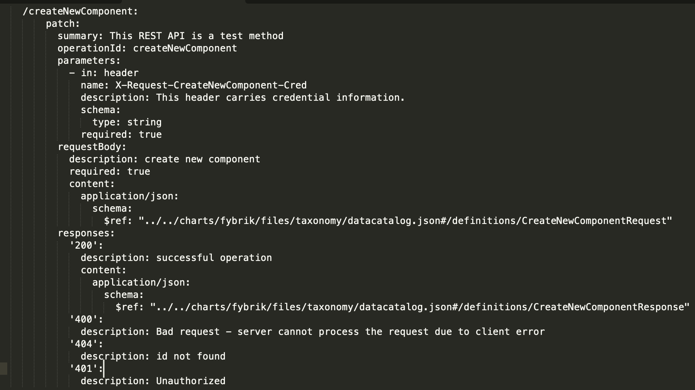
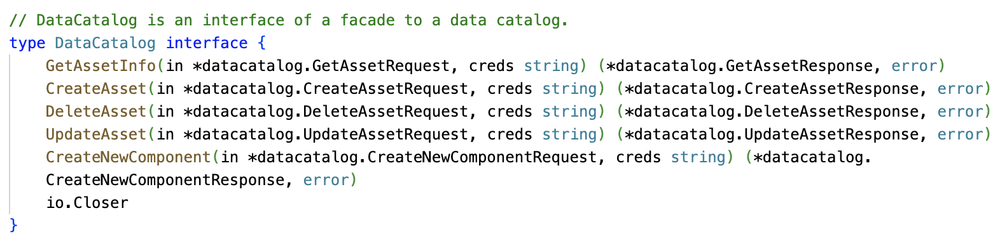
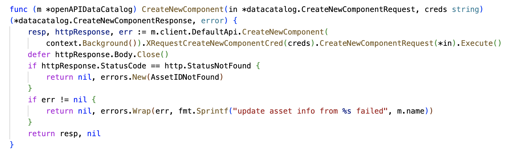
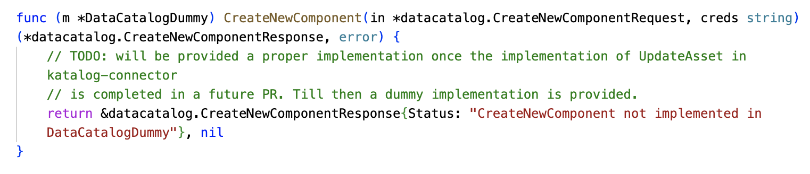

# Steps to creating a new REST API using Fybrik Taxonomy

## TL;DR

* Suppose you want to add a REST method  createNewComponent  in the  datacatalog  list of apis\.
* Edit connectors/api/datacatalog\.spec\.yaml
* Edit pkg/model/datacatalog/api\.go
* Run make generate in fybrik root
  * Generates json files\. Remove external\.json\. Keep the others.
* make generate\-client\-datacatalog
  * Generates openapiclient files in pkg/connectors/datacatalog/openapiclient
  * Add these two lines in pkg/connectors/datacatalog/openapiclient/model\.go
    * type     CreateNewComponentRequest   =   datacatalog\.CreateNewComponentRequest
    * type     CreateNewComponentResponse   =   datacatalog\.CreateNewComponentResponse
* Define the new method in pkg/connectors/datacatalog/clients/datacatalog\.go
  * CreateNewComponent  \(in \*  datacatalog\.CreateNewComponentRequest  \, creds   string  \) \(\*  datacatalog\.CreateNewComponentResponse  \,   error  \)
* Add the implementation of    CreateNewComponent  \(\) method \(client side\)  in datacatalog\_openapi\.go
* Add server side implementation of  CreateNewComponent  in any connector
* Add   CreateNewComponent   implementation in manager/controllers/  mockup   
* make verify  to fix tab issues 

## Longer Version

### Step 1: Define OpenAPI specification for the REST API

Suppose we want to create a new REST API:  createNewComponent  under the  datacatalog  group of APIs\.

Then we can define the API in  datacatalog\.spec\.yaml  under  fybrik  /connectors/  api    folder as follows:

### Step 2: Define request and response objects

Edit  pkg/model/  datacatalog  /  api\.go   

### Step 3: Generate the taxonomy files

Run  make generate  in  fybrik   root  folder

  * Generates json files\. Remove external\.json\. Keep the others

### Step 4: Generate OpenApiClient related client code

  * Run the following command in  connectors/api  folder to generate openapiclient files in  pkg/connectors/datacatalog/openapiclient
    * 	make generate\-client\-datacatalog
  * Add these two lines in  pkg/connectors/datacatalog/openapiclient/model\.go
    * 	type     CreateNewComponentRequest   =   datacatalog\.CreateNewComponentRequest
    * 	type     CreateNewComponentResponse   =   datacatalog\.CreateNewComponentResponse

### Step 5: Define and Implement the new REST API in the datacatalog interface

Define the new method  CreateComponent  in  datacatalog\.go    in  pkg/connectors/datacatalog/clients/

Add the implementation of    CreateNewComponent  \(\) method \(client side\) in   datacatalog\_openapi\.go   

### Step 6: Add server side  logic for the REST API

Add server side implementation of  CreateNewComponent  \(\) in any connector 

### Step 7: Add test / dummy implementation of REST API in manager/mockup

Add   CreateNewComponent   implementation in manager/controllers/  mockup   

### Step 8: Verify the changes

Run   make verify   in   fybrik   root folder to fix go\-linting / go\-compilation issues 

### Discussions

The example used in this document is implemented in this github branch for reference\. Please check this link for more details : [https://github\.com/rohithdv/fybrik/tree/taxonomy\-kt](https://github.com/rohithdv/fybrik/tree/taxonomy-kt)

