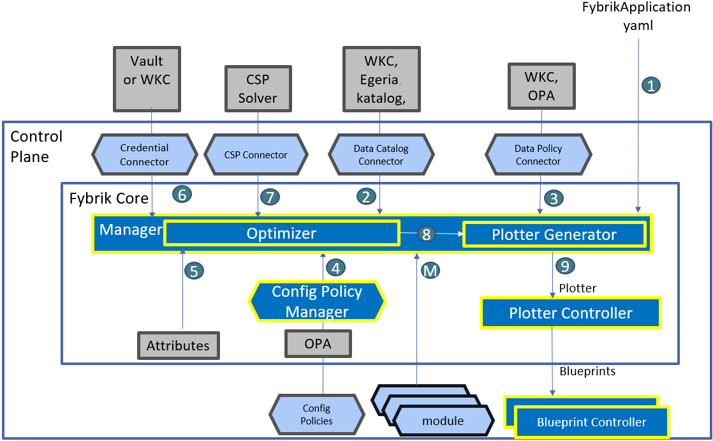

# Architecture

Fybrik takes a modular approach to provide an open platform for controlling
and securing the use of data across an organization. The figure below showcases the
current architecture of the Fybrik platform, running on top of Kubernetes.

The core parts of Fybrik are based on Kubernetes controllers and Custom Resource Definitions (CRDs) in order to define its work items and reconcile the state of them.

The primary interaction object for a data user is the `FybrikApplication` custom resource (1) where a user defines which data should be used for which purpose. The following chart and description describe the architecture and components of Fybrik relative to when they are used.

## Modules

Before the data user can perform any actions a data operator has to [install](../get-started/quickstart.md) Fybrik and modules.  
[Modules](./modules.md) (M) describe capabilities that can be included in a data plane. 

These may be existing open source or third party services, or custom ones. The module of a service indicates the capabilities it supports, the formats and interfaces, and how to deploy the service.  Modules may describe externally deployed services, or services deployed by fybrik.  Examples of modules are those that provide read/write access or produce implicit copies that serve as lower latency caches of remote assets.  
Modules may also perform actions to enforce data governance policy decisions, such as masking or redaction as examples.

## Connectors 
Fybrik connects to external services to receive data governance decisions, metadata about datasets and credentials. Policies, assets and access credentials to the assets have to be defined before the user can run an application.

The current abstraction supports 2 different [connectors](./connectors.md): one for data catalog (2) and one for policy manager (3). It is designed in an open way so that multiple different catalog and policy frameworks of all kinds of cloud and on-prem systems can be supported.

The data steward configures policies  in an external policy manager over assets defined in an external data catalog. Dataset credentials are retrieved from Vault by using [Vault API](https://www.vaultproject.io/api) (6). Vault uses a custom secret engine implemented with [HashiCorp Vault plugins system](./vault_plugins.md) to retrieve the credentials from where they are stored (data catalog for example).

## FybrikApplication
Once the Modules and Connectors are installed, a developer can submit a `FybrikApplication` CRD to Kubernetes.

The `FybrikApplication` holds metadata about the application such as the data assets required by the application, the processing purpose and the method of access the user wishes (protocol e.g. S3 or Arrow flight). 

The `FybrikApplicationController` will make sure that all the specs are fulfilled and that the data is read/written/copied/deleted in accord with the data governance policies and the IT config policies.

The controller uses the information provided in the `FybrikApplication`, to check with the data-governance policy manager if the data flow requested is allowed and whether restrictive actions such as masking or hashing have to be applied. Taking into account these governance actions, as well as application requirements, dataset specification, available infrastructure (5) and the [IT config policies](./config-policies.md) defined (4), the controller compiles a plotter (9).  

## Plotter
The plotter specifies a data plane connecting the application to the datasets it requires. More specifically, the plotter lists the modules to use, the capabilities required from these modules, the cluster on which each module should be deployed, as well as the flow of data between the asset and the workload through the chosen modules. 

For the plotter to be optimal in terms of the defined optimization goals (a.k.a. IT config soft policies), the controller may use a [CSP-based optimizer](./optimizer.md) (7). 
If no CSP engine is installed, optimization goals will not be taken into account, and the manager will use the first (but not necessarily optimal) solution that meets all of the other requirements.

## Blueprint
As data assets may reside in different clusters/clouds a `Blueprint` CRD is created for each cluster, containing the information regarding the services to be deployed or configured in the given cluster. Depending on the setup the `PlotterController` will use various methods to distribute the blueprints. 

A single [blueprint](../reference/crds.md#blueprint) contains the specification of all assets that shall be accessed in a single cluster by a single application.
The `BlueprintController` makes sure that a blueprint can deploy all needed modules and tracks their status. Once e.g. an implicit-copy module finishes the copy the blueprint is also in a ready state.
A read or write module is in ready state as soon as the proxy service such as the arrow-flight module is running.

In a multi cluster setup the default distribution implementation is using [Razee](http://razee.io) to control remote blueprints, but several multi-cloud tools could be used as a replacement.  

The `PlotterController` also collects statuses and distributes updates of said blueprints.  
Once all the blueprints on all clusters are ready the plotter is marked as ready, and the overall status is propagated back to the user in the `FybrikApplication` status.

