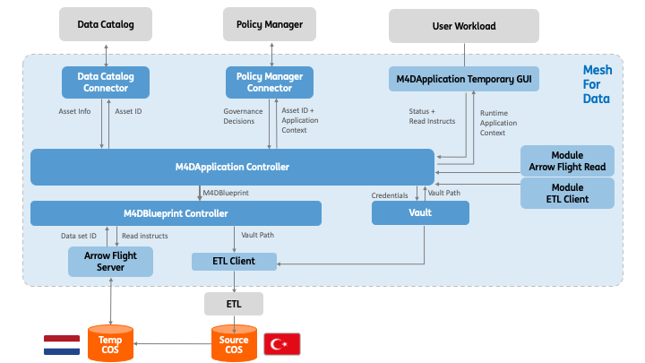

# Modules

The project currently has two extension mechanisms, namely connectors and modules. 
This page describes what modules are and how they are leveraged by the Fybrik control plane to build the data plane flow.  

## What are modules?

As described in the [architecture](./architecture.md) page, the control plane generates a description of a data plane based on policies and application requirements. This is known as a blueprint, and includes components that are deployed by the control plane to fulfill different data-centric requirements.  For example, a component that can mask data can be used to enforce a data masking policy, or a component that copies data may be used to create a local data copy to meet performance requirements, etc. 

Modules are the way to describe such data plane components and make them available to the control plane. A module is packaged as a [Helm](https://helm.sh/) chart that the control plane can install to a workload's data plane. To make a module available to the control plane it must be [registered](#registering-a-module) by applying a [`FybrikModule`](../reference/crds.md#fybrikmodule) custom resource.

The functionality described by the module may be deployed (a) per workload, or (b) it may be composed of one or more components that run independent of the workload and its associated control plane.  In the case of (a), the control plane handles the deployment of the functional component. In the case of (b) where the functionality of the module runs independently and handles requests from multiple workloads, a client module is what is deployed by the control plane.  This client module passes parameters to the external component(s) and monitors the status and results of the requests to the external component(s). 
<!-- TODO: Add "which are declared as a dependencies in the module yaml"  when we support it-->

The following diagram shows an example with an Arrow Flight module that is fully deployed by the control plane and a second module where the client is deployed by the control plane but the ETL component providing the functionality has been independently deployed and supports multiple workloads.



## Components that make up a module

There are several parts to a module:

1. **Optional** external component(s): deployed and managed independently of Fybrik.
1. [Module Workload](../contribute/modules.md#module-workload): the workload that runs once the Helm chart is installed by the control plane.
Can be a client to the external component(s) or be independent.
1. [Module Helm Chart](../contribute/modules.md#module-helm-chart): the package containing the module workload that the control plane installs as part of a data plane.
1. [FybrikModule YAML](../contribute/modules.md#fybrikmodule-yaml): describes the functional capabilities, supported interfaces, and has links to the Module Helm chart.

## Registering a module

To make the control plane aware of the module so that it can be included in appropriate workload data flows, the administrator must apply the FybrikModule YAML in the `fybrik-system` namespace.  This makes the control plane aware of the existence of the module.  Note that it **does not** check that the module's helm chart exists.

For example, the following registers the `arrow-flight-module`:
```bash
kubectl apply -f https://raw.githubusercontent.com/fybrik/arrow-flight-module/master/module.yaml -n fybrik-system
```

## When is a module used?

There are four main data flows in which modules may be used:

* Read - preparing data to be read and/or actually reading the data.
* Write - writing a new data set or appending data to an existing data set.
* Copy - for performing an implicit data copy on behalf of the application.  The decision to do an implicit copy is made by the control plane, typically for performance or governance reasons.
* Delete - for deleting objects or data sets.

A module may be used in one or more of these flows, as is indicated in the module's yaml file.

## Control plane choice of modules

A user workload description `FybrikApplicaton` includes a list of the data sets required, the technologies that will be used to access them, the access type (e.g. read, copy), information about the location and reason for the use of the data.  This information together with input from data and [enterprise policies](config-policies.md), determine which modules are chosen by the control plane and where they are deployed. 

## Available modules

The table below lists the currently available modules:

Name | Description | FybrikModule | Prerequisite
---  | ---         | ---       | ---
[arrow-flight-module](https://github.com/fybrik/arrow-flight-module) | reading and writing datasets while performing data transformations using [Arrow Flight](https://arrow.apache.org/docs/format/Flight.html) | https://raw.githubusercontent.com/fybrik/arrow-flight-module/master/module.yaml |
[airbyte-module](https://github.com/fybrik/airbyte-module) | reading datasets from data sources supported by the [Airbyte](https://airbyte.com) tool | https://raw.githubusercontent.com/fybrik/airbyte-module/main/module.yaml |
[delete-module](https://github.com/fybrik/delete-module) | deletes s3 objects | https://raw.githubusercontent.com/fybrik/delete-module/main/module.yaml |
[implicit-copy](https://github.com/fybrik/mover) | copies data between any two supported data stores, for example S3 and Kafka, and applies transformations. | https://raw.githubusercontent.com/fybrik/data-movement-operator/master/modules/implicit-copy-batch-module.yaml<br> <br>https://raw.githubusercontent.com/fybrik/data-movement-operator/master/modules/implicit-copy-stream-module.yaml | <nobr>[`FybrikStorageAccount`](../../reference/crds#appfybrikiov1beta2)</nobr> resource deployed in the control plane namespace to hold the details of the storage which is used by the module for coping the data
[dremio-module](https://github.com/fybrik/dremio-module) | configures a [Dremio cluster](https://docs.dremio.com/software/deployment/) for data access in Fybrik | https://raw.githubusercontent.com/fybrik/dremio-module/main/dremio-module.yaml |
[trino-module](https://github.com/fybrik/trino-module) | configures a [Trino cluster](https://trino.io/docs/current/overview/concepts.html#cluster) for data access in Fybrik  | https://raw.githubusercontent.com/fybrik/trino-module/main/trino-module.yaml |
[REST-read-example-module](https://github.com/fybrik/REST-read-example) | an example of Fybrik read module that uses REST protocol to connect to a [FHIR](https://www.hl7.org/fhir/overview.html) server to obtain medical records  | https://raw.githubusercontent.com/fybrik/REST-read-example/main/restFHIRmodule.yaml |  | 
[hello-world-read-module](https://github.com/fybrik/hello-world-read-module) | an example of a read module for Fybrik | https://raw.githubusercontent.com/fybrik/hello-world-read-module/main/hello-world-read-module.yaml |  | 
[template-module](https://github.com/fybrik/template-module) | a template github repository that helps develop a Fybrik module faster and easier | | 


## Contributing

Read  [Module Development](../contribute/modules.md) for details on the components that make up a module and how to create a module.
