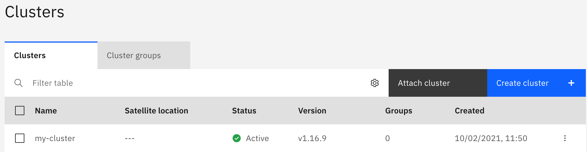

# Multicluster setup

Fybrik is dynamic in its multi cluster capabilities in that it has abstractions to support multiple
different cross-cluster orchestration mechanisms. Currently, only one multi cluster orchestration mechanism is implemented
and is using [Razee](http://razee.io) for the orchestration.

## Multicluster operation with Razee

Razee is a multi-cluster continuous delivery tool for Kubernetes that can deploy software on remote clusters and track
the deployment status of such deployments. There are multiple ways to run Razee. The two described here are a vanilla open source deployment on your
own Kubernetes or as a managed service from a cloud provider. Due to the complex nature of installing Razee a managed service from a cloud provider is
recommended. 
It's possible to define a multicluster group name that groups clusters that are used in a Fybrik instance. This will restrict the clusters that 
are usable in the Fybrik instance to the ones that are registered in the specified Razee group. This is especially helpful if Razee is also 
used for different purposes than Fybrik or multiple Fybrik instances should be used under the same Razee installation.

In general there is a need for the following Razee components to be installed:

* Razee watch keeper (installed on all clusters)
* Razee cluster subscription manager (installed on all clusters)
* RazeeDash API (installed on coordinator cluster/as cloud service)

Both methods below describe how the above components can be installed depending on what RazeeDash deployment method
is used.

### Installing Razee on Kubernetes

#### Coordinator cluster
An installation of the open source components is described [here](https://razee.io/#get-razee).
Please follow the instructions in the Razee documentation to install [RazeeDash](https://github.com/razee-io/Razee/blob/master/README.md#installing-razeedash),
[Watch keeper](https://github.com/razee-io/Razee/blob/master/README.md#installing-watch-keeper-in-every-cluster-that-you-want-to-monitor) and
the [cluster subscription agent](https://github.com/razee-io/Razee/blob/master/README.md#automating-the-deployment-of-kubernetes-resources-across-clusters-and-environments).
At the moment Razee supports GitHub, GitHub Enterprise and BitBucket for the OAUTH Authentication of this installation.

Please be aware that the RazeeDash API needs to be reachable from all clusters. Thus, there may be the need for routes, ingresses or node ports
 in order to expose it to other networks and clusters.

<!-- TODO maybe add a description on how to install it including openshift routes etc -->

Once RazeeDash is installed the UI can be used to group registered clusters in a multicluster group that can be configured below.
The API Key can also be retrieved from the UI following these two steps.

1. From the RazeeDash console, click the arrow icon in the upper right corner. Then, select Profile.
2. Copy the API key value. If no API key exists, click Generate to generate one.

In order to configure Fybrik to use the installed Razee on Kubernetes the values of the helm charts have to be adapted
to the following:
```
coordinator:
  razee:
    # URL for Razee deployment
    url: "https://your-razee-service:3333/graphql"
    # Razee deployment with oauth API key authentication requires the apiKey parameter
    apiKey: "<your Razee X_API_KEY>"
    multiclusterGroup: "<your group name>"
```

#### Remote cluster

The remote clusters only need the watch keeper and cluster subscription agents installed. The remote clusters do not need the coordinator component
of Fybrik. It's enough to follow [this guide](https://github.com/razee-io/Razee/blob/master/README.md#installing-watch-keeper-in-every-cluster-that-you-want-to-monitor)
to install the agents and configure a group via the RazeeDash UI if needed.
The coordinator configuration would look like the following:
```
coordinator:
    enabled: false
```

### Installing using IBM Satellite Config

When using [IBM Satellite Config](https://cloud.ibm.com/satellite) the RazeeDash API is running as a service in the
cloud and all custom resource distribution is handled by the cloud. The process here describes how an already existing Kubernetes
cluster can be registered and configured. 

Prerequisites:

* An IBM Cloud Account
* IBM Cloud Satellite service
* IAM API Keys with access to IBM Cloud Satellite service



The step below has to be executed for each cluster that should be added to
the Fybrik instance. This step is the same for coordinator and remote clusters.

1. In the IBM Satellite Cloud service under the **Clusters** tab click on **Register cluster**.
2. Enter a cluster name in the popup dialog and click **Register cluster**. (Please don't use spaces in the name)
3. The next dialog will offer you a `kubectl` command that can be executed on the cluster that should be attached.
4. After executing the `kubectl` command the Razee services will be installed in the `razeedeploy` namespace and the cluster
   will show up in your cluster list (like in the picture above). This installs the watch keeper and cluster subscription components.
5. Create clusters groups by clicking on the **Cluster groups** tab: for each cluster create a group named `fybrik-<cluster-name>` and add the cluster to that group. In addition, create a single group for all the clusters: the name of this group is used when deploying the coordinator cluster as shown below.

The next step is to configure Fybrik to use IBM Satellite config as multicluster orchestrator. This configuration is done via a 
Kubernetes secret that is created by the helm chart. Overwriting the `coordinator.razee` values in your deployment will make use of the
multicluster tooling.
A configuration using IBM Satellite Config would look like the following for the coordinator cluster:
```
coordinator:
  # Configures the Razee instance to be used by the coordinator manager in a multicluster setup
  razee:
    # IBM Cloud IAM API Key of a user or service account that have access to IBM Cloud Satellite Config
    iamKey: "<your IAM API KEY key>"
    multiclusterGroup: "<your group name>"
```

For the remote cluster the coordinator will be disabled:
```
coordinator:
    enabled: false
```


## Configure Vault for multi-cluster deployment

The Fybrik uses [HashiCorp Vault](https://www.vaultproject.io/) to provide running Fybrik modules in the clusters with the dataset credentials when accessing data. This is done using [Vault plugin system](https://www.vaultproject.io/docs/internals/plugins) as described in [vault plugin page](../concepts/vault_plugins.md).


This section describes steps for the Fybrik modules to authenticate with Vault, in order to obtain database credentials.

Some of the steps described below are not specific to the Fybrik project but rather are Vault specific and can be found in Vault-related online tutorials.

Module authentication is done by configuring Vault to use [Kubernetes auth method](https://www.vaultproject.io/docs/auth/kubernetes) in each cluster. Using this method, the modules can authenticate to Vault by providing their service account token. Behind the scenes, Vault authenticates the token by submitting a TokenReview request to the API server of the Kubernetes cluster where the module is running.

### Prerequisites unless Fybrik modules are running on the same cluster as the Vault instance:

1. The running Vault instance should have connectivity to the cluster API server for each cluster running Fybrik modules.
1. The running Vault instance should have an Ingress resource to enable Fybrik modules to get the credentials.

### Before you begin

Ensure that you have the [Vault v1.9.x](https://www.vaultproject.io/docs/commands) to execute Vault CLI commands.
### Enabling Kubernetes authentication for each cluster with running Fybrik modules:

1. Create a token reviewer service account called `vault-auth` in the `fybrik-system` namespace and give it permissions to create `tokenreviews.authentication.k8s.io` at the cluster scope:

```bash
apiVersion: v1
kind: ServiceAccount
metadata:
  name: vault-auth
  namespace: fybrik-system
---
apiVersion: v1
kind: Secret
metadata:
  name: vault-auth
  namespace: fybrik-system
  annotations:
    kubernetes.io/service-account.name: vault-auth
type: kubernetes.io/service-account-token
---
apiVersion: rbac.authorization.k8s.io/v1
kind: ClusterRoleBinding
metadata:
  name: role-tokenreview-binding
roleRef:
  apiGroup: rbac.authorization.k8s.io
  kind: ClusterRole
  name: system:auth-delegator
subjects:
  - kind: ServiceAccount
    name: vault-auth
    namespace: fybrik-system
```

1. Login to Vault:
```bash
vault login
```

1. Enable the Kubernetes auth method in a new path:
```bash   
vault auth enable -path=<auth path> kubernetes
```

1. Use the /config endpoint to configure Vault to talk to Kubernetes:
```bash
TOKEN_REVIEW_JWT=$(kubectl get secret vault-auth -n fybrik-system -o jsonpath="{.data.token}" | base64 --decode)
vault write auth/<auth path>/config \
    token_reviewer_jwt="$TOKEN_REVIEW_JWT" \
    kubernetes_host=<Kubernetes api server address> \
    kubernetes_ca_cert=@ca.crt
```
More details on the parameters in the command above can be found in [Vault's documentation](https://www.vaultproject.io/api/auth/kubernetes).

1. Add the Vault policy and role to allow the modules to get the dataset credentials. More details on defining Vault policy for Fybrik can be found in [HashiCorp Vault plugins page](../concepts/vault_plugins.md). The Vault role which binds the policy to the modules can be defined in the following example:
```bash
vault write auth/<auth path>/role/module \
    bound_service_account_names="*" \
    bound_service_account_namespaces=<modules namespace> \
    policies="allow-all-dataset-creds" \
    ttl=24h
```
1. Deploy the Fybrik helm chart with `--set cluster.vaultAuthPath=<auth path>` parameter

