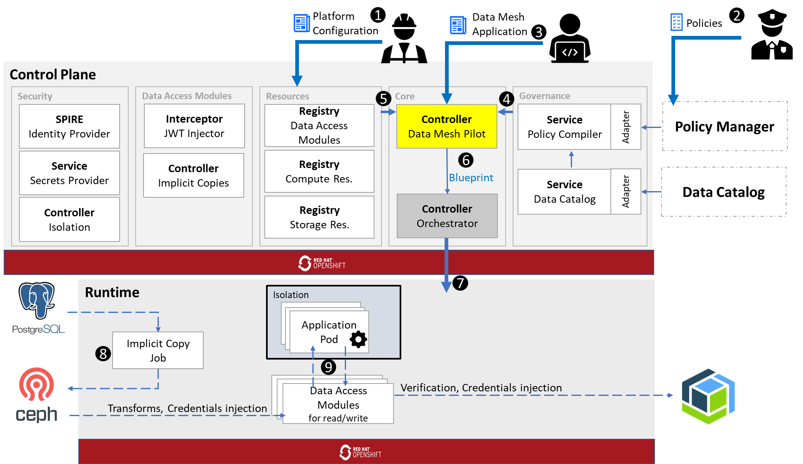


The information below is outdated


 takes a **modular** approach to provide an open platform for controlling and securing the use of data across an organization. The figure below showcases the current architecture of the  platform, running on top of OpenShift Container Platform. The storage systems shown in the lower half of the figure are merely an example.

 A  operator configures the resources available to : compute and storage resources used to run governance actions and optimize data access performace, and `M4DModule` resources that describe modules injectable into the data path.

 A data streward configures policies in an external policy manager over assets defined in an external data catalog. The policy manager and data catalog are connected to  `PolicyCompiler` and `DataCatalog` services via `PolicyManagerAdapter` and `DataCatalogAdapter`, respectively.

 A developer submits a `M4DApplication` resource (e.g., via CI/CD pipeline) holding metadata about the application. such metadata includes the data assets required by the application and the processing purpose.

 The _pilot_, a core component of , processes the submission and retrieves a set of all governance actions required to be enforced according to policies. This is also performed upon any policy change.

 The pilot retrives information about the resources and modules that it can use. Specifically, it searches for modules that can enforce the required governance actions without impacting the application in terms of performance and used client SDKs.

 The pilot generates a `Blueprint` describing the entire data path, including components injected into the data ingress and egress paths of the application.

 The _orchestrator_, a core component of , processes the blueprint and deploys all runtime components accordingly. In the current release the deployment is to the same OpenShift Container Platform that the  control plane runs in.

 Processing jobs for preparing the environment for the application are running. The figure shows an example of creating an implicit copy job to copy data from PostgresSQL to Ceph.

 The application reads from and writes data to whitelisted targets. Requests are handled by `M4DModule` instances. The application can not interact with non-whitelisted targets.
