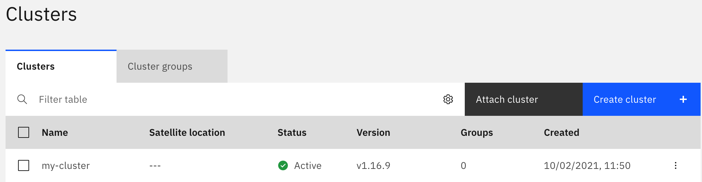

 is dynamic in its multi cluster capabilities in that it has abstractions to support multiple
different cross-cluster orchestration mechanisms. The default mechanism that is described here is using [Razee](http://razee.io).


## Multicluster operation with Razee

Razee is a multi-cluster continuous delivery tool for Kubernetes that can deploy software on remote clusters and track
the deployment status of such deployments. There are multiple ways to run Razee. The two desribed here are a vanilla open source deployment on your
own Kubernetes or as a managed service from a cloud provider. The two different setups are described below.
In general there is a need for:
* Razee watch keeper (installed on all clusters)
* Razee cluster subscription manager (installed on all clusters)
* RazeeDash API (installed on controller cluster/as cloud service)

### Installing Razee on Kubernetes

An installation of the open source components is described [here](https://razee.io/#get-razee). 
(TODO maybe add a description on how to install it including openshift routes etc)

The credentials to access Razee have to be configured in a special secret in the `m4d-system` namespace.

TODO Describe how to use Razee with API key and Github authentication once implemented.

In order to configure  to use razee environment variables have to be configured for the 
manager component.

```
envFrom:
- secretRef:
    name: razee-credentials
- configMapRef:
    name: m4d-config
```

### Installing using IBM Satellite Config

When using [IBM Satellite Config](https://cloud.ibm.com/satellite) the RazeeDash API is running as a service in the
cloud and all CRD distribution is handled by the cloud. The process here describes how an already existing Kubernetes
cluster can be registered and configured.



1. In the IBM Satellite Cloud service under the `Clusters` tab click on `Attach cluster`.
2. Enter a cluster name in the popup dialog and click `Register cluster`. (Please don't use spaces in the name)
3. The next dialog will offer you a `kubectl` command that can be executed on the cluster that should be attached.
4. After executing the `kubectl` command the Razee services will be installed in the `razeedeploy` namespace and the cluster
  will show up in your cluster list (like in the picture above).
   
The next step is to configure  to use IBM Satellite config as multicluster orchestrator. The razee credentials secret
can be created using `kubectl create secret generic razee-credentials --from-literal=IAM_API_KEY=<iam api key> --from-literal=RAZEE_ORG_ID=<razee org id>`.
The IAM API key can be from a service id that has access to the Satellite service.

The manager deployment has to be changed to include the razee secret as environment variables.
1. Edit the manager using `kubectl -n m4d-system edit deployments.apps m4d-controller-manager`
2. Replace the environment spec for the `manager` container to include the `razee-credentials` secret.
deployment with the following: 
```
envFrom:
- secretRef:
    name: razee-credentials
- configMapRef:
    name: m4d-config
```
3. After a restart of the manager it is configured to use IBM Cloud Satellite config.